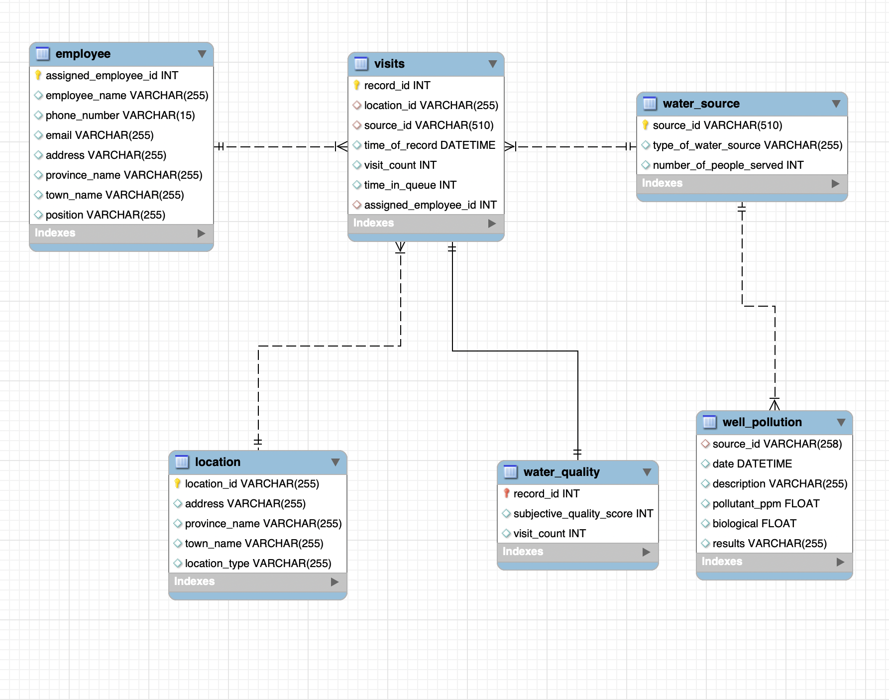
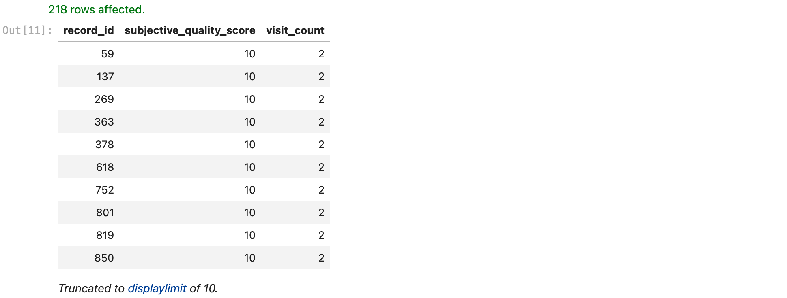
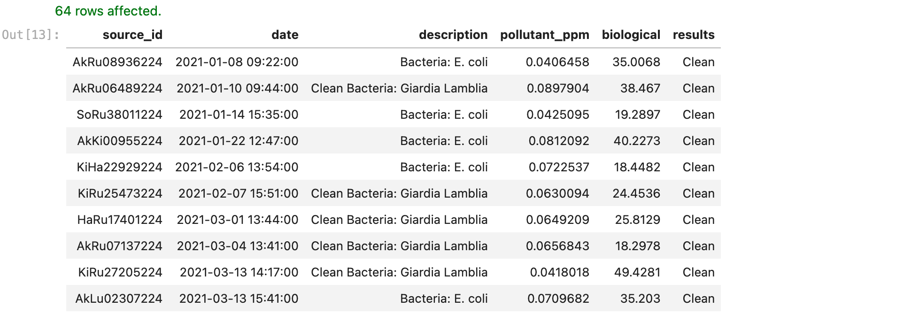
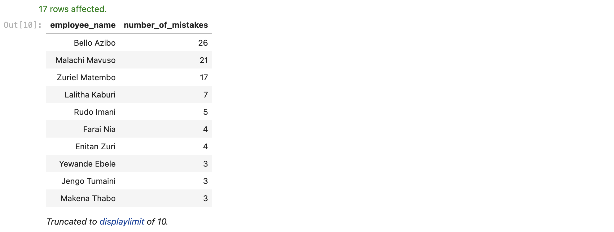
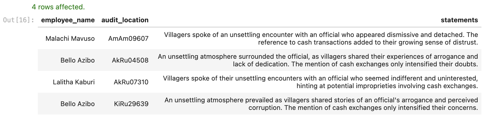
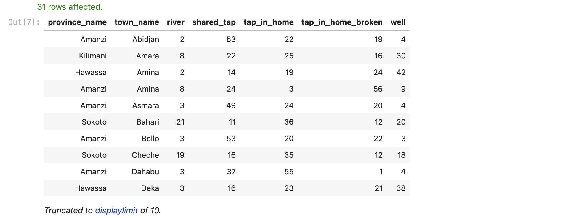

# Restoring the lifeblood of Maji Ndogo
## Introduction
At the heart of this project is a **water crisis** faced by a fictitious **country** called **Maji Ndogo**. The project dives deep into the intricacies of using SQL to solve complex problems with data, siphoning interesting and thought-probing insights.

## Acknowledgments
This project was undertaken in partial fulfillment of the requirements on [ALX + Explore AI Academy's Data Science curriculum](https://www.explore.ai/learn/courses/data-science). 

## Project overview
This project is split into four parts, each progressively building from the last both in SQL syntax difficulty and depth of analysis. It also provides a good blueprint for how to approach and tackle problems with data using the Structured Query Language (SQL).

## Part 1: Beginning our data-driven journey in Maji Ndogo
The first part of the project dives into Maji Ndogo's expansive database containing **60,000** records spread across various tables. As we navigated this trove of data, we used basic queries to familiarise ourselves with the content of each table. Along the way, we also refined some data using Data Manipulation Language (DML).

### Initial Data Exploration
We started exploring the data to get a high level overview of what it looked like after importing the data into a relational database. Our initial exploration of the database revealed a total of **8** entities:

| Tables_in_md_water_services |
| --------------------------- |
| data_dictionary                                        |
| employee                                               |
| global_water_access                                    |
| location                                               |
| visits                                                 |
| water_quality                                          |
| water_source                                           |
| well_pollution                                         |

The `data_dictionary` entity has information describing each entity's attributes. **6** of the entities in the database are related to each other as shown in the ERD diagram below.

### Water Sources
Inspection of the `water_source` entity revealed the types of water sources recorded in the database. There are **5** types of water sources in **Maji Ndogo**:

| type_of_water_source |
| -------------------- |
| tap_in_home                              |
| tap_in_home_broken                       |
| well                                     |
| shared_tap                               |
| river                                    |

### Water Sources Visits
We also took a look at the `visits` entity in the databsae which logged information on each water source each and every time the water source was visited. One of the interesting attributes in this entity is the `time_in_queue` attribute which recorded the average time people spent in queues during the visit.

We filtered for observations `WHERE time_in_queue > 500` from the entity which returned **105** observations. We investigated further to reveal the `type_of_water_source` with such long `time_in_queue` observations which was revealed to be the `shared_tap` water source which most oftenly served approximately more than `3000` people.

### Water Sources Quality
There's an entity in the relational database pertaining to `water_quality` which has records of water quality scores assigned by surveyors. We narrowed down our analysis on the quality of water sources after getting a peak of what the `visit` entity entailed. The quality of the water sources is the whole point of the survey per the project description.

However, we ran into a potential issue with the records in this entity as there were **218** records with a `visit_count` of **2** and a  `subjective_quality_score` of **10**. But as per the project's description, the surveyors only revisited shared taps with a **low** `subjective_quality_score` and not other types of water sources. Technically, there shouldn't have been records with visit count of more than or equal to **2** where the quality score assigned is **10**, i.e. the water source was deemed to be of good quality by the surveyor.

### Water Pollution
We also investigated the pollution issues using the `well_pollution` entity which contains records of pollution/contamination of wells in **Maji Ndogo**. The records in this entities show results recorded during surveyors' visits. We uncovered that there were `Clean` wells, `Biological`ly and `Chemical`ly contaminted ones.

We checked the integrity of the observations just to make sure we don't have any **false positives** which might mislead people to consume water that's unsafe for consumption.

As per the project's description, the `description` column should have "Clean" if the observation has **no biological contamination (and no chemical pollutants)**. This hinted on possible errornous data entry. We filtered the entity for records where:

- The `description` mistakenlly read `Clean Bacteria: E. Coli` instead of `Bacteria: E. Coli`.
- The `description` mistakenly read `Clean Bacteria: Giardia Lamblia` instead of `Bacteria: Giardia Lamblia`.

We ran a query which returned **38** such records which we updated the `results` column from `Clean` to `Contaminated: Biological` where the `biological` column had a value `> 0.01`

## Part 2: Clustering data to unveil Maji Ndogo's water crisis
In this second part of the project, we geared up for a deep analytical dive into Maji Ndogo's water scenario harnessing the power of a wide range of **functions**, including **intricate window functions**, to tease out insights from the entities.

### Data Analysis
We started with some preliminary data exploration and cleaning of the `employee` entity.

We also investigated the `location` entity to understand where various water sources and types were located in **Maji Ndogo**.

We explored the `water_source` entity further to get a deeper understanding of the data and the population being served by the water sources scattered across **Maji Ndogo**.

Queues and Queue times were an important part of the study as we analysed the `visits` entity which documented all of the visits the field surveyors made to each location.

### Insights Summary
1. Most water sources are located in **rural** areas.
2. **43%** of the population use shared taps. Approximately **2000 people** on average, often shared one tap.
3. **31%** of the population has water infrastructure in their homes, but within that group, **45%** face non-functional systems due to issues with pipes, pumps, and reservoirs.
4. **18%** of the population use wells of which only **28%** are clean.
5. Citizens in Maji Ndogo often face long wait times for water, averaging more than **120 minutes**.
6. In terms of queues:
    - Queues are very long on Saturdays.
    - Queues are longer in the mornings and evenings.
    - Wednesdays and Sundays have the shortest queues.

## Part 3: Weaving the data threads of Maji Ndogo's narrative
In this third part of the project, we pulled data from **many different tables** and applied some **statistical analyses** to examine the consequences of an audit report that cross-referenced a random sample of records.

### Data Audit
We imported and integrated an auditors' report, in the form of a `.csv` file into the existing schema and used the auditors' report to perform a comparative analysis against the surveyors' records.

An initial comparison of surveyors' scores against matched auditors' records revealed that approximately **94%** of surveyors' records were accurate as per the auditors' report.

We also investigated the remaining **6%** of the surveyors' records revealing a number of surveyors, **17** of them, had erronous records as per the auditors' report. We than aggregate the no. of times each of the surveyors logged an errornous record and sorted them in descending order on the count of errors.

To focus on extreme cases, we computed the average no. of mistakes that were made by the surveyors when logging their records. We found out that **6** mistakes were made on average and filtered for surveyors that made more mistakes than the average no. of mistakes revealing the top **4** surveyors from the image above.

Finally we investigated the potential cause of the high number of errornous records made by the respective surveyors. The auditors' report also contains statements made by locals recorded by the auditors, which could potentially point to some leads on why there were a huge number of errors *(compared to the average)* logged by the respective surveyors

## Part 4: Charting the course for Maji Ndogo's water future
We finalised our data analysis using the **full suite of SQL tools** gaining our final insights and used them to classify water sources, and prepared relevant data for the relevant stakeholders i.e. Maji Ndogo's engineering teams.

### Final analysis
We started by building a pivot table to breakdown and highlight the data with respect to location attributes like province and town names and water source types to help us understand:

1. Where the problems occured
2. What was needed to improve the water source at the specified location

### Recommended Strategy & Practical Solutions
We also came up with a strategy that would help us start aleviating Maji Ndogo's water crisis efficiently, and it involved the following:

1. Concentrating Maji Ndogo's primary efforts on improving water sources that affected the most people i.e:
    - Most people will benefit if we improve the shared taps first.
    - Wells are a good source of water, but many are contaminated. Fixing this will benefit a lot of people.
    - Fixing existing infrastructure will help many people. If they have running water again, they won't have to queue, thereby shortening queue times for others *Killing two birds with one stone*.
    - Installing taps in homes will stretch Maji Ndogo's resources too thin, so for now, if the queue times are low, we won't improve that source.
2. Ensuring the respective stakeholders e.g. engineering teams, know that most water sources are located in rural areas as this means they will have to make necessary repairs/upgrades in rural areas where there could be potential challenges like poor road conditions, insufficient supplies and skilled labour which are harder to overcome.

At a high level, the Improvements to be implemented were as follows:

1. `river`s → Drill wells
2. `well`s: if the well is contaminated with chemicals → Install RO filter
3. `well`s: if the well is contaminated with biological contaminants → Install UV and RO filter
4. `shared_taps`: if the queue is longer than 30 min (30 min and above) → Install `X` taps nearby where `X` number of taps is calculated using `X = FLOOR(time_in_queue / 30)`
5. `tap_in_home_broken` → Diagnose local infrastructure

### Solution Implementation
We finally implemented our plan in the database to share the data with relevant stakeholders on what issues to focus on when implementing the recommended actions to start aleviating the water crisis while impacting huge sections of the affected population simultaneously.